# Apresentação

  Instituto Superior de Gestão e Administração de Santarém TeSP TPSI Base de Dados de uma Empresa de Transportes Alunos: João Duarte Nº 22006556 e Diogo Chança Nº 22000701 Docente: Prof. Marco Tereso Unidade Curricular: Base de Dados I Santarém Ano letivo 2020-2021

---
## Índice

- [Resumo](#Resumo)

- [Introdução](#Introdução)

- [Descrição da base de dados](#Descrição-da-base-de-dados)

- [Base de dados em modo escrito](#Base-de-dados-em-modo-escrito)

- [Base de dados em modelo entidade relação estendida](#Base-de-dados-em-modelo-entidade-relação-estendida)

- [Base de dados em modelo concetual](#Base-de-dados-em-modelo-concetual)

- [Tabelas da base de dados preenchidas](#Tabelas-da-base-de-dados-preenchidas)

- [Conclusão](#Conclusão)

---

### Resumo

Este trabalho consiste em criar uma base de dados que permita gerir uma empresa de transportes de mercadorias. Para tal pretende-se elaborar o levantamento dos requisitos e desenvolver o modelo de base de dados desenvolvido no MYSQL Workbench.

---

### Introdução

 Pretende se elaborar um trabalho com o objetivo de demonstrar os conhecimentos já lecionados na unidade curricular, também a pedido do professor que apresentou os temas de trabalho. No mesmo pretendemos demonstrar a capacidade de trabalhar em grupo e demonstrar as competências adquiridas ao longo do semestre na Unidade Base de Dados I. Para tal pretendemos elaborar uma base de dados de uma empresa de transportes de mercadorias, de modo a melhorar a organização na empresa e a maneira como são guardados, para ser mais atrativa e fácil de pesquisar os dados.
Começámos por levantar os requisitos da empresa (irá ser explicado mais tarde) e depois de ter os requisitos foi começar a identificar tabelas e atributos de modo a criar o modelo de Entidade Relação Estendida (visto que haverá herança de atributos) e a Base de Dados.

---

### Descrição

Uma Empresa de Transportes pretende construir uma base de dados, que tem de ter informações acerca dos funcionários que podem ser motoristas ou gerentes, os camiões e as viagens feitas. Em relação aos funcionários, eles têm de ter um nome, data de nascimento, Número de Identificação Fiscal, rua, número de porta, localidade, código postal e o salário. Em relação aos motoristas, eles têm de ter a carta de condução que pode ser de tipo C ou C+E e tem de estar renovada e possuírem os certificados atualizados como o Certificado de Aptidão de Motorista ou CAM e a licença de matérias perigosas que permite transportar combustível ou outro tipo de matéria explosiva ou inflamável. Os camiões têm uma marca, modelo, matrícula, um tipo que pode ser trator, semirreboque, cisterna, estrado, lona e frigorífico, cor e o peso bruto. Eles têm de ser inspecionados periodicamente de modo a não haver problemas.

---

### Base de dados em modo escrito

funcionario (codFuncionario, nome, dataNascimento, nif, rua, numPorta, localidade, codPostal, salario)

motorista (codMotorista, codFuncionario, codCartaCond)

categoriaCarta (codCategoria, nomeCategoria)

validarCarta (codCategoria, codCartaCond, dataValidacao, dataLimite)

certificado (codCertificado, descricao)

validarCertificado (codMotorista, codCertificado, dataValidacao)

gerente (codGerente, codFuncionario)

camiao (numChassis, matricula, marca, modelo, cor, codTipo, pesoBruto)

tipoCamiao (codTipo, descricao)

inspecao (codInspecao, numChassis, codMotorista, dataInspecao, dataValidacao, nomeLocal, localidade)

viagem (idViagem, codMotorista, codGerente, numChassis, dataComeco, dataFinal, numKm, carga, descricao)

---

### Base de dados em modelo entidade relação estendida

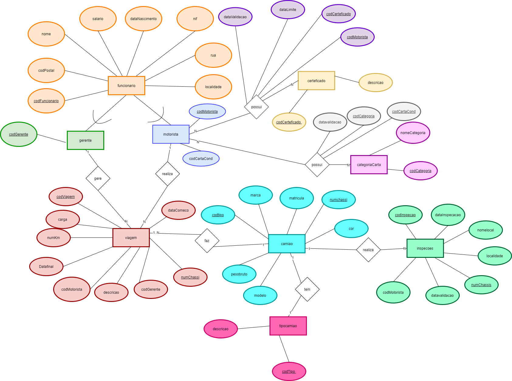

---

### Base de dados em modelo concetual

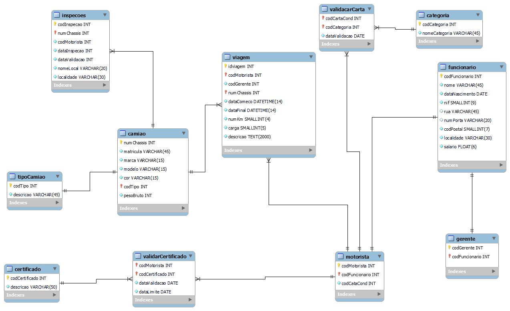

---

### Tabelas da base de dados preenchidas

Tabela funcionário

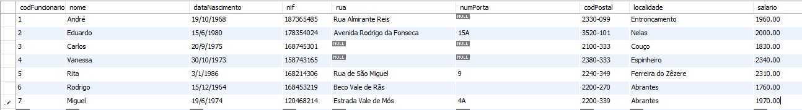

Tabela motorista

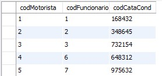

Tabela categoria de carta

Tabela validação da carta

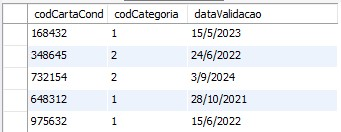

Tabela certificado

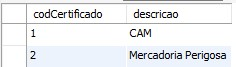

Tabela validação da carta

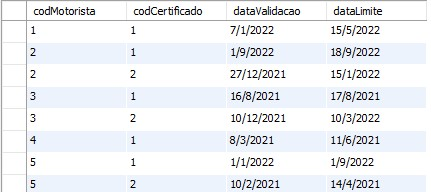

Tabela camião

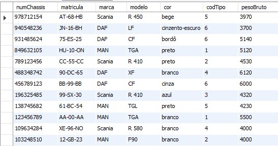

Tabela tipo

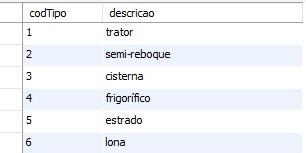

Tabela inspeção

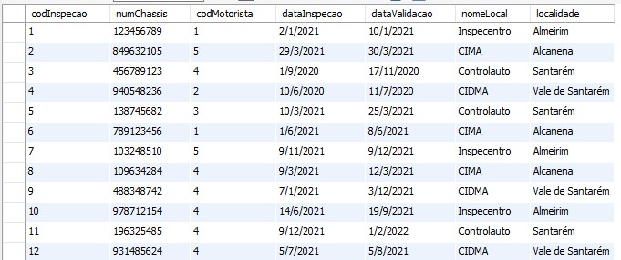

Tabela gerente

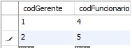

Tabela viagem

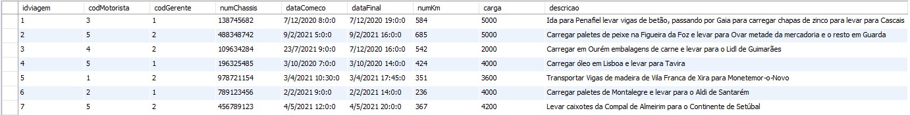

---

### Conclusão

Com a conclusão, podemos concluir que até agora estamos bem na disciplina e que fizemos com algumas dificuldades, mas conseguimos concretizar o mesmo. E no mesmo exprimimos o que foi lecionado até agora e estamos preparados para o próximo semestre em que teremos novamente a disciplina.

